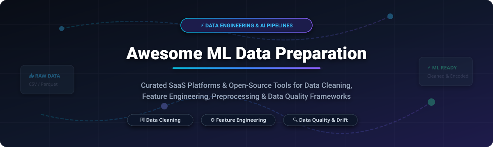

  

  
  
  
  
  

<h1 align="center">Awesome Machine Learning Data Preparation 🚀</h1>

> **The definitive curated hub for Machine Learning Data Preparation 🧹, Automated Preprocessing ⚡, Data Cleaning 🧼, Feature Engineering ⚙️, and Data Quality Frameworks 🔍 in 2026.**

---

Whether you are building enterprise ML pipelines 🏢, fine-tuning Large Language Models (LLMs) 🤖, or preparing complex tabular datasets 📊, clean and well-structured data is the foundation of high-performing AI models. This repository tracks top **commercial SaaS platforms** and **open-source GitHub tools** for end-to-end data wrangling, validation, and feature engineering.

---

## 📌 Table of Contents

- [📊 Market Overview & Ecosystem Dynamics](#-market-overview--ecosystem-dynamics)
- [💼 SaaS & Hosted Data Preparation Platforms](#-saas--hosted-data-preparation-platforms)
- [🐍 Open-Source GitHub Projects](#-open-source-github-projects)
- [🛠️ Key Features Comparison](#%EF%B8%8F-key-features-comparison)
- [🤝 How to Contribute](#-how-to-contribute)
- [⚠️ Disclaimer & Best Practices](#%EF%B8%8F-disclaimer--best-practices)
- [💖 Support & Community](#-support--community)
- [⭐ Star History](#-star-history)

---

## 📊 Market Overview & Ecosystem Dynamics

> **📈 Sector Market Size & Dynamics**: The global machine learning data preparation market is estimated at **$5.2 Billion in 2026** and projected to reach **$14.8 Billion by 2030** (CAGR ~29.8%). The sector remains **moderately to highly fragmented**—competing across cloud hyperscalers, specialized ETL/transformation tools, visual data wrangling suites, and open-source data quality libraries without a single "winner-take-all" monopolist.

---

## 💼 SaaS & Hosted Data Preparation Platforms

*Sorted by Company Size / Valuation (Descending)* 📉

| Platform / Product | Starting Price 🏷️ | Free Tier / Trial Limit 🎁 | Company Valuation / Revenue 💰 | Primary Focus & Capabilities ⚡ |
| :--- | :--- | :--- | :--- | :--- |
| **[Microsoft Azure Data Factory & Power Query](https://azure.microsoft.com/en-us/products/data-factory/)** 🌐 | ~$0.25 / DIU-hour (activity run dependent) | 12 Months Free Tier ($200 credits for 30 days + limited low-freq activities free) | **~$3.9 Trillion** Market Cap | Serverless data integration, ETL pipelines, and visual Power Query transformation interface. |
| **[Amazon SageMaker Data Wrangler](https://aws.amazon.com/sagemaker/data-wrangler/)** ☁️ | ~$1.02 / hour (`ml.m5.4xlarge` instance) | 2 Months Free Tier (25 hours/month of `ml.m5.4xlarge`) | **~$2.1 Trillion** (AWS ~$100B+ ARR) | AWS visual data prep tool with 300+ built-in transformations and SageMaker Feature Store integration. |
| **[Databricks Lakehouse](https://www.databricks.com/)** 🧱 | ~$0.07 – $0.40 per DBU (compute dependent) | 14-Day Free Trial ($400 free usage credits included) | **~$190 Billion** Valuation ($7B+ ARR) | Unified Data & AI platform powered by Spark, Delta Lake, and automated data processing. |
| **[Alteryx Designer Cloud & Trifacta](https://www.alteryx.com/)** 🔄 | $250 / user / month (Starter Edition) | 30-Day Free Trial (Alteryx One cloud platform) | **~$4.4 Billion** Valuation ($1B+ ARR) | Enterprise standard for visual drag-and-drop data wrangling, blending, and predictive preparation. |
| **[dbt Cloud](https://www.getdbt.com/)** 🛠️ | $100 / user / month (Starter Plan) | **Free Forever** Developer Plan (1 user, 1 project, up to 3,000 models/mo) | **~$4.2 Billion** Valuation ($100M+ ARR) | SQL-first data transformation platform with automated documentation, testing, and DAG scheduling. |
| **[Dataiku DSS](https://www.dataiku.com/)** 🔬 | ~$4,000 / month (Estimated entry deployment) | 14-Day Free Trial (Plus Free Community Edition for local install) | **~$3.7 Billion** Valuation ($350M+ ARR) | Enterprise collaborative data science platform combining visual recipes with Python/R code environments. |
| **[Tamr](https://www.tamr.com/)** 🧠 | Subscription per workspace (unlimited seats) | 30-Minute Free Interactive Demo (No self-service free tier) | **~$300 Million** Valuation ($140M+ total funding) | AI-powered data mastering, automated entity resolution, and schema unification at scale. |
| **[Prophecy.io](https://www.prophecy.io/)** 🔮 | $150 / user / month (Professional Plan) | **Free Forever** Starter Plan (1 user, 20 credits/mo) / 21-Day Trial | **~$268 Million** Valuation ($159M total funding) | Low-code visual pipeline builder generating production-grade Apache Spark and SQL code. |
| **[Coalesce.io](https://coalesce.io/)** ⚡ | $150 / user / month (Starter Plan) | **Free Forever** Developer Plan (1 user, 2,000 actions/mo) / 14-Day Trial | **~$225 Million** Valuation ($87M total funding) | Column-aware data transformation platform built natively for Snowflake environments. |

---

## 🐍 Open-Source GitHub Projects

*Sorted by GitHub Stars_Count (Descending)* ⭐

### 1. [DuckDB](https://github.com/duckdb/duckdb) 🦆

- **Description**: An in-process SQL OLAP database management system designed for fast analytical queries on tabular datasets, Parquet files, and CSVs directly from Python and R.
- **Key Strengths**: Zero external dependencies, ultra-fast vector execution, seamless integration with Pandas and Arrow. 🚀

### 2. [Polars](https://github.com/pola-rs/polars) 🐻‍❄️

- **Description**: Lightning-fast DataFrames library written in Rust with Python bindings, built for multi-threaded, memory-efficient data processing.
- **Key Strengths**: Lazy evaluation engine, low memory footprint, out-of-core streaming data execution. ⚡

### 3. [Hugging Face Datasets](https://github.com/huggingface/datasets) 🤗

- **Description**: Lightweight and extensible library to easily share, load, and preprocess audio, vision, and NLP datasets for Deep Learning & LLMs.
- **Key Strengths**: Memory-mapped zero-copy file access, streaming support for multi-terabyte datasets, seamless PyTorch/TensorFlow integration. 📦

### 4. [YData Profiling](https://github.com/ydataai/ydata-profiling) 📊

- **Description**: Generate comprehensive exploratory data analysis (EDA) reports from Pandas and Spark DataFrames with a single line of code.
- **Key Strengths**: Automated missing value analysis, feature correlations, distribution metrics, and data drift detection. 📈

### 5. [OpenRefine](https://github.com/OpenRefine/OpenRefine) 💎

- **Description**: Power tool for working with messy data—cleaning it, transforming it from one format into another, and extending it with web services.
- **Key Strengths**: Interactive web-based UI, powerful clustering algorithms for entity deduplication, undo/redo history. 🧽

### 6. [Great Expectations](https://github.com/great-expectations/great_expectations) ✅

- **Description**: Industry standard framework for data validation, profiling, and pipeline documentation.
- **Key Strengths**: Declarative quality assertions, automated HTML data docs generation, integrations with Airflow, dbt, Spark. 🎯

### 7. [Cleanlab](https://github.com/cleanlab/cleanlab) 🧪

- **Description**: The standard data-centric AI package for identifying mislabeled data and dataset noise across image, text, and tabular datasets.
- **Key Strengths**: Confident Learning framework, automated label error detection, active learning optimization. 🎯

### 8. [PyCaret](https://github.com/pycaret/pycaret) 🪄

- **Description**: Open-source, low-code machine learning library in Python that automates machine learning workflows including automated preprocessing and scaling.
- **Key Strengths**: Automated missing value imputation, encoding, feature selection, and model training in a single workflow. 🤖

### 9. [Evidently AI](https://github.com/evidentlyai/evidently) 🔮

- **Description**: Evaluation and monitoring framework for data quality, feature drift, and ML model performance.
- **Key Strengths**: 100+ built-in metrics, interactive dashboarding, automated dataset drift checks for production ML. 📊

### 10. [Featuretools](https://github.com/alteryx/featuretools) 🛠️

- **Description**: Framework for automated feature engineering using Deep Feature Synthesis (DFS) on relational and transactional datasets.
- **Key Strengths**: Automatic aggregation and transformation features across multi-table datasets. ⚙️

### 11. [Data-Juicer](https://github.com/modelscope/data-juicer) 🧃

- **Description**: One-stop data processing system for multimodal LLM pre-training and fine-tuning datasets.
- **Key Strengths**: 50+ built-in data processing operators, Ray cluster distributed processing, customizable YAML recipes. 🦾

### 12. [Argilla](https://github.com/argilla-io/argilla) 🦔

- **Description**: Collaboration platform for LLM data curation, human feedback (RLHF), and high-quality synthetic data generation.
- **Key Strengths**: Annotator coordination, active learning pipelines, Hugging Face Hub integration. 🤝

### 13. [AWS Deequ](https://github.com/awslabs/deequ) 🛡️

- **Description**: Library built on top of Apache Spark for defining "unit tests for data" to validate large-scale datasets.
- **Key Strengths**: Scalable metric computation, constraint validation, automated data profiling on Spark. ⚡

### 14. [Soda Core](https://github.com/sodadata/soda-core) 🥤

- **Description**: CLI tool and Python library for data quality checking and dataset monitoring across SQL databases.
- **Key Strengths**: Declarative SodaCL YAML checks, support for Snowflake, BigQuery, Postgres, and DuckDB. 🔍

### 15. [Desbordante](https://github.com/Desbordante/desbordante-core) 🌊

- **Description**: High-performance C++ core data profiler and pattern discovery engine with web and CLI interfaces.
- **Key Strengths**: Fast functional dependency discovery, outlier detection, data profiling. 🚀

### 16. [Gators](https://github.com/paypal/gators) 🐊

- **Description**: Lightning-fast feature engineering and preprocessing library developed by PayPal, built on Polars.
- **Key Strengths**: 75+ Polars-based transformers, scikit-learn API compliance, high-performance encoders. ⚡

### 17. [OMR (Omni Data Refinement)](https://github.com/Omar-Alshafai2/omni-data-refinement) 🔬

- **Description**: Pure Python framework for dataset quality scoring, validation, drift detection, and monitoring.
- **Key Strengths**: 12 domains of data intelligence, 5-pillar health score, zero external API dependencies. 🏥

### 18. [AKDATA](https://github.com/arikaranrs/AKDATA) ⚡

- **Description**: Automated preprocessing library for tabular datasets with automated leakage protection and dataset health scoring.
- **Key Strengths**: Automated missing value imputation, outlier detection, fit-transform split consistency. 🛡️

### 19. [SanitiPy](https://github.com/adambenaamr/sanitipy) 🧼

- **Description**: Intelligent data quality analysis and ML-assisted data cleaning package.
- **Key Strengths**: Structured dataset profiling, rule-based quality validation, human-in-the-loop cleaning suggestions. 💡

---

## 🛠️ Key Features Comparison

| Category 🗂️ | Recommended Tools 🧰 | Primary Use Case 💡 |
| :--- | :--- | :--- |
| **High-Performance In-Memory Data Prep** ⚡ | Polars, DuckDB | Large-than-RAM tabular processing & fast SQL transformations |
| **Automated Feature Engineering** ⚙️ | Featuretools, Gators | Relational aggregations, datetime features, target encoding |
| **Data Quality & Validation** ✅ | Great Expectations, Soda Core, AWS Deequ | Automated data unit tests, schema assertions, pipeline gates |
| **Data-Centric AI & Label Cleaning** 🧪 | Cleanlab, YData Profiling | Detecting noisy labels, outliers, and class imbalance |
| **LLM & Multimodal Prep** 🤖 | Data-Juicer, Argilla, HF Datasets | Cleaning corpus text, synthetic data filtering, RLHF feedback |
| **Enterprise Cloud Pipelines** ☁️ | SageMaker Data Wrangler, Databricks, dbt Cloud | Scalable corporate infrastructure, governed feature stores |

---

## 🤝 How to Contribute

Contributions are highly welcome! To add a new SaaS platform or Open-Source project to this list:

1. **Fork** 🍴 this repository.
2. Update `README.md` following the established table / list formatting.
3. Ensure all links, descriptions, and Stars_Counts/pricing details are accurate.
4. Submit a **Pull Request** 🚀 with a clear title and description.

---

## ⚠️ Disclaimer & Best Practices

- 👥 **Community Driven**: This is a curated resource and does not imply official endorsement of any commercial platform.
- 🔒 **Data Privacy & Governance**: Data preparation platforms often handle sensitive PII (Personally Identifiable Information). Ensure proper encryption, role-based access control (RBAC), and regulatory compliance when choosing SaaS or open-source solutions.
- 🛡️ **Preventing Target Leakage**: Data leakage is a critical issue in ML pipelines. Use fit-transform separation (e.g. computing scaling/imputation parameters strictly on training sets) to ensure models generalize accurately in production.

---

## 💖 Support & Community

Thank you for visiting **Awesome Machine Learning Data Preparation**! If you find this curated list helpful for your ML engineering workflows, research, or enterprise data pipelines, please consider supporting the project:

- ⭐ **Star this repository** to help others discover it!
- 🍴 **Fork the repo** and contribute new tools or updates.
- 📢 **Share with your network** on Twitter/X, LinkedIn, and developer communities.
- ☕ **Sponsor / Buy me a coffee**: Support ongoing open-source curation and maintenance via the [GitHub Sponsor Dashboard](https://github.com/sponsors/ishandutta2007)!

  

---

## ⭐ Star History

---

  <b>Made with ❤️ for ML Engineers, Data Scientists, and Data Engineers worldwide.</b>

